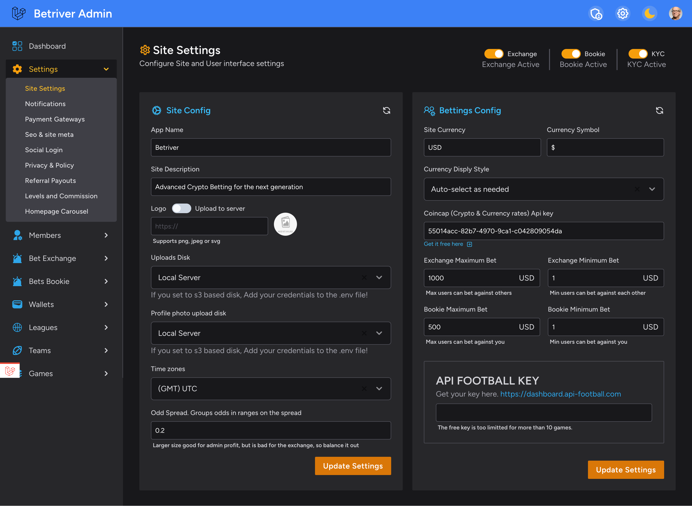

# Betriver Site Settings

## Betriver Site Settings&#x20;

<figure><figcaption></figcaption></figure>


#### Basic Configuration

* **App Name**: Set your platform name (default: "Betriver")
* **Site Description**: Brief description of your platform displayed to users
* **Logo Upload**:
  * Supports PNG, JPEG, or SVG formats
  * Can be uploaded to local server
  * Recommended size: Keep under 1MB for optimal loading

#### Storage Settings

* **Uploads Disk**: Choose storage location for uploads
  * If using S3-based storage, add credentials to the .env file
*   **Profile Photo Upload**: Configure storage for user profile photos

    * Same storage options as general uploads
    * Consider space requirements based on expected user base


## **Using S3 Example for digital ocean/Linode**

**Go to your site directory and fine these lines. Edit them with your credentials.**\


```
// Some code
# Digital Ocean S3
DO_SPACES_KEY=VNC5N...KEOKHI2
DO_SPACES_SECRET=X236y3Oz...oHT
DO_SPACES_ENDPOINT=https://eu-central-1.linodeobjects.com
DO_SPACES_REGION=eu-central-1
DO_SPACES_BUCKET=static.betriver.io
DO_SPACES_CDN=https://static.betriver.io
```

### Time and Odds Settings

* **Time zones**: Select your platform's operating timezone (default: UTC)
* **Odd Spread**: Configure odds ranges for betting groups.  Read more about the odds spread setting in the sub pages.
  * Recommended: 0.2 for balanced exchange operations
  * Note: Larger spreads increase admin profit but may reduce exchange activity

### Bettings Config Section

#### Currency Settings

* **Site Currency**: Set primary currency (e.g., USD)
* **Currency Symbol**: Define display symbol ($, €, etc.)
* **Currency Display Style**: Choose how currency is shown throughout the platform

#### API Configuration

* **Coincap API Key**: Required for real-time crypto & currency rates
  * Get free key from provided link
  * Essential for accurate currency conversion

#### Betting Limits

Exchange Limits:

* Maximum Bet: 1000 USD (adjustable)
* Minimum Bet: 1 USD (adjustable)
* Controls max users can bet against others

Bookie Limits:

* Maximum Bet: 500 USD (adjustable)
* Minimum Bet: 1 USD (adjustable)
* Controls max users can bet against house

#### Football API Integration. The site uses API footbale for data.&#x20;

* Get API key from: https://dashboard.api-football.com
* Free tier limited to 10 games
* Required for automatic games and results betting features

### Important Notes

1. All changes require clicking "Update Settings" to take effect
2. Test settings in a staging environment before applying to production
3. Keep backup of working configuration before making major changes
4. Monitor exchange spread settings impact on user activity
