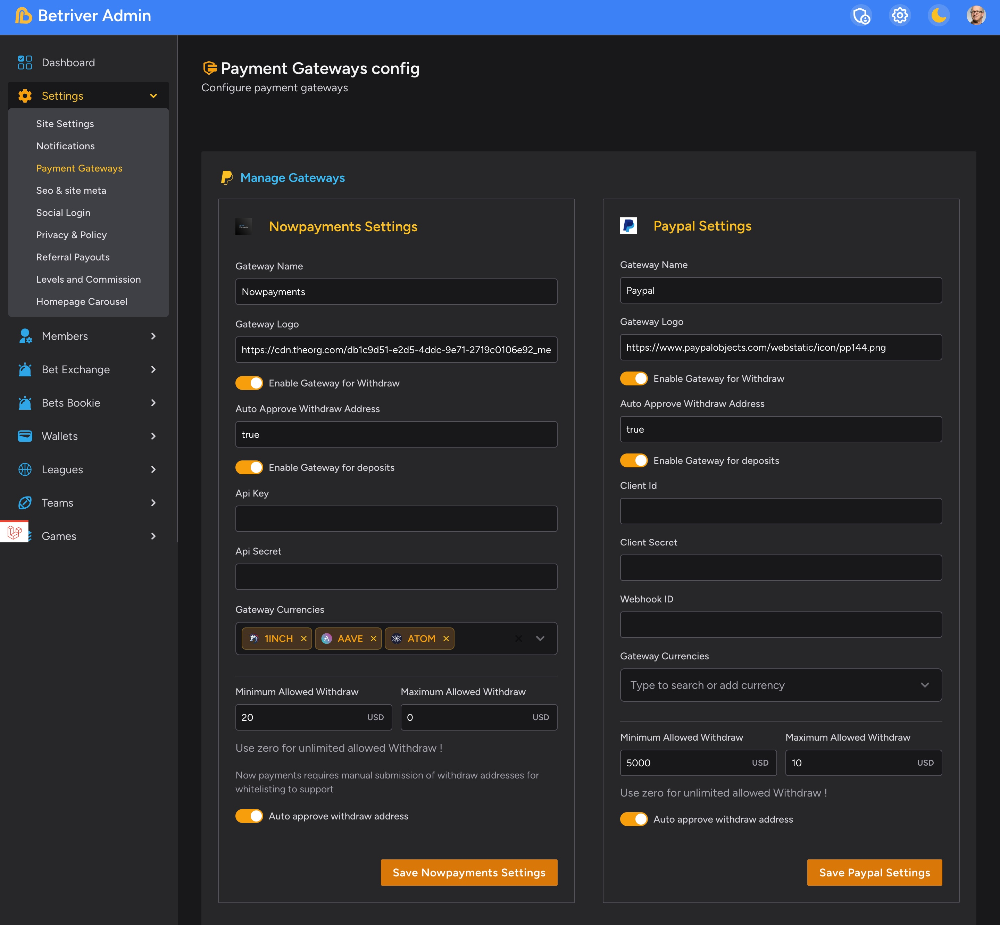

# Manage Payment Gateways:

<figure><figcaption></figcaption></figure>

* Configure the Nowpayments gateway by entering the Gateway Name, Gateway Logo URL, and enabling it for withdrawals and deposits.

Paypal Settings:

* Enter the Paypal gateway name and logo URL.
* Enable the gateway for withdrawals and deposits.
* Provide the Auto Approve Withdraw Address, Client ID, and Client Secret.

Gateway Currencies:

* You can select the currencies to enable, such as INCH, AAVE, and ATOM.

Withdrawal Limits:

* Set the Minimum and Maximum Allowed Withdraw amounts in USD.
* Enable "Use zero for unlimited allowed Withdraw" if desired.
* Toggle "Auto approve withdraw address" to automatically approve withdrawal requests.

Be sure to save the Nowpayments and Paypal settings after configuring them. Let me know if you need any clarification or have additional questions!
